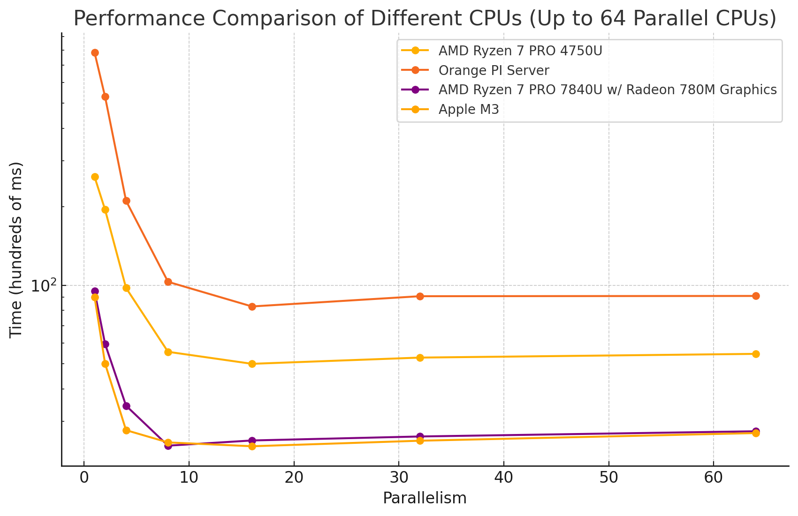

# CPU JWT Performance Testing



This repository contains a performance test suite for JWT (JSON Web Token) generation and verification across different CPU architectures and levels of parallelism.

## Overview

This project tests the performance of JWT operations (generation and verification) using Go. It measures the execution time across various levels of parallelism on different CPU architectures.

### What it does

1. Generates and verifies 100,000 JWTs.
2. Tests performance with different levels of parallelism (1, 2, 4, 8, 16, 32, 64, 128 threads).
3. Provides implementations in both Go and Python for comparison.

## Results

Here are the results across several CPUs tested:

| Parallelism | AMD Ryzen 7 PRO 4750U Time (s) | Orange PI Server Time (s) | AMD Ryzen 7 PRO 7840U w/ Radeon 780M Graphics Time (s) | Apple M3 Time (s) |
|-------------|--------------------------------|---------------------------|--------------------------------------------------------|-------------------|
| 1           | 2.606525456                    | 7.820487302               | 0.948404308                                            | 0.901172084       |
| 2           | 1.950887441                    | 5.295343401               | 0.595318560                                            | 0.500320625       |
| 4           | 0.976232511                    | 2.109358044               | 0.344738233                                            | 0.277665333       |
| 8           | 0.555131526                    | 1.030656644               | 0.242141736                                            | 0.249188792       |
| 16          | 0.499219326                    | 0.828977931               | 0.253518548                                            | 0.240891417       |
| 32          | 0.527477246                    | 0.907511773               | 0.262633156                                            | 0.252963792       |
| 64          | 0.545153065                    | 0.909654316               | 0.275025240                                            | 0.270662583       |
| 128         | 0.568881179                    | 0.877619716               | 0.296455694                                            | 0.280405625       |


## Usage

1. To run the Go version:
   ```
   go run main.go
   ```

2. To build for different architectures, use the build script in the `scripts` directory.


